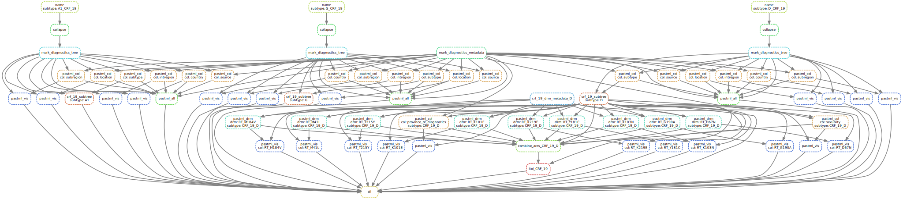

# HIV1-CRF19_Cuba
Phylogenetic analyses of CRF19 spread in Cuba and worldwide.

## Citation
Zhukova A, Voznica J, Dávila Felipe M, To T-H, Pérez L, Martı́nez Y, et al. (2021) Cuban history of CRF19 recombinant subtype of HIV-1.
_PLoS Pathog_ 17(8): e1009786. [doi:10.1371/journal.ppat.1009786](https://doi.org/10.1371/journal.ppat.1009786)

## Analysis pipelines

The [*snakemake*](snakemake) folder contains Snakemake [[Köster *et al.*, 2012](https://doi.org/10.1093/bioinformatics/bts480)] pipelines
for reconstruction of evolutionary history of HIV-1 in Cuba:
* [*Snakefile_datasets*](snakemake/Snakefile_datasets) for D, A1 and G data set creation

* [*Snakefile_trees*](snakemake/Snakefile_trees) for phylogenetic tree reconstruction, rooting and dating

* [*Snakefile_acr*](snakemake/Snakefile_acr) for phylogeographic, drug resistance and transmission mode analyses

## Data
### Multiple sequence alignments
* [*data/input*](data/input) folder contains the input curated 2018 HIV-1 alignment from [Los Alamos database](https://www.hiv.lanl.gov/content/sequence/NEWALIGN/align.html),
and the input files for [jpHMM](http://jphmm.gobics.de/).
* [*data/datasets/D_CRF_19/aln.first.cleaned.fa*](data/datasets/D_CRF_19/aln.first.cleaned.fa), 
[*data/datasets/A1_CRF_19/aln.first.cleaned.fa*](data/datasets/A1_CRF_19/aln.first.cleaned.fa), 
[*data/datasets/G_CRF_19/aln.first.cleaned.fa*](data/datasets/G_CRF_19/aln.first.cleaned.fa) contain the combined CU+LA MSAs (including 5 outgroup sequences indicated in outgroup.txt files in the corresponding folders) for the D/A1/G data sets used for these analyses (produced with [*Snakefile_datasets*](snakemake/Snakefile_datasets) pipeline).
### Metadata
* [*data/datasets/metadata.tab*](data/datasets/metadata.tab) contains the combined metadata for CU and LA sequences used for these analyses (produced with [*Snakefile_datasets*](snakemake/Snakefile_datasets) pipeline). It contains the following columns:
It contains the following columns:
	* *id* -- identifier of the sequence used in these analyses (corresponds to the tree tips);
	* *POL Accession Number* -- [GenBank](https://www.ncbi.nlm.nih.gov/genbank/) accession number for the *pol* part of the sequence;
	* *ENV Accession Number* -- [GenBank](https://www.ncbi.nlm.nih.gov/genbank/) accession number for the *env* part of the sequence;
	* *source* -- source of the data: LA or CU;
	* *province\_of\_diagnostics* -- province of diagnostics for CU sequences, abroad for LA;
	* *country\_code* -- ISO2 code for the country of sampling;
	* *country* -- country of sampling;
	* *intregion* -- generalized location of sampling, includes the following values: Australia, Cuba, Eastern Africa, Eastern Asia, Middle Africa, Northern America, Northern Europe, Russia, South America, Southern Africa, Southern Asia, Southern Europe, Western Africa, Western Asia, Western Europe;
	* *subregion* -- generalized location of sampling, includes the following values: Asia, Australia and New Zealand, Cuba, Europe, Northern America, Russia, South America, Sub-Saharan Africa; 
	* *region* -- generalized location of sampling, includes the following values: Africa, Americas, Asia, Cuba, Europe, Oceania;	
	* *sample\_date* -- date of sampling;
	* *diagnostics\_date* -- date of diagnostics;
	* *gender* -- gender of the infected individual: F or M;
	* *sexuality*	-- declared behavioural category: Bisexual, HT (heterosexual), or MSM (men-who-have-sex-with-men);
	* *treated* -- treatment status: naive or treated;
	* *subtype\_annotated* -- pre-annotated HIV-1 subtype;
	* *subtype\_jpHMM* -- HIV-1 subtype detected by jpHMM;
	* *subtype\_consensus* -- HIV-1 subtype annotations used in this study: pre-annotated ones when compatible with jpHMM (e.g. matching jpHMM breakpoints for CRF19), otherwise jpHMM prediction;
	* *subtype\_tree* -- HIV-1 subtype detected by the phylogenetic trees in this study (same as consensus for the majority of the sequences, see \nameref{par:phylogeny*);
	* *subtype\_CRF\_19\_D* -- whether the sequence is compatible with CRF19 in its D part according to jpHMM: D if yes, empty otherwise;
	* *subtype\_CRF\_19\_G* -- whether the sequence is compatible with CRF19 in its G part according to jpHMM: G if yes, empty otherwise;
	* *subtype\_CRF\_19\_A1* -- whether the sequence is compatible with CRF19 in its A1 part according to jpHMM: A1 if yes, empty otherwise.
* [*data/datasets/iTOL_colorstrip-subtype.txt*](data/datasets/iTOL_colorstrip-subtype.txt) contains an [iTOL](https://itol.embl.de/)-compatible colourstrip representing HIV-1 subtype detected by the phylogenetic trees in this study;
* [*data/datasets/D_CRF_19/metadata.drms.tab*](data/datasets/D_CRF_19/metadata.drms.tab), [*data/datasets/D_CRF_19/metadata.drugs.tab*](data/datasets/D_CRF_19/metadata.drugs.tab) contain the Surveillance DRM and ARV metadata for the D+CRF_19 sequences 
extracted with [Sierra](https://hivdb.stanford.edu/page/webservice/) (see [*Snakefile_datasets*](snakemake/Snakefile_datasets) pipeline).
* [*data/datasets/D_CRF_19/lsd2.dates*](data/datasets/D_CRF_19/lsd2.dates), 
[*data/datasets/A1_CRF_19/lsd2.dates*](data/datasets/A1_CRF_19/lsd2.dates), 
[*data/datasets/G_CRF_19/lsd2.dates*](data/datasets/G_CRF_19/lsd2.dates) contain the dates and constraints used to date the D/A1/G phylogenies with [LSD2](https://github.com/tothuhien/lsd2).

### Phylogenies
* [*data/datasets/D_CRF_19/rooted_tree.nwk*](data/datasets/D_CRF_19/rooted_tree.nwk), 
[*data/datasets/A1_CRF_19/rooted_tree.nwk*](data/datasets/A1_CRF_19/rooted_tree.nwk), 
[*data/datasets/G_CRF_19/rooted_tree.nwk*](data/datasets/G_CRF_19/rooted_tree.nwk) are the rooted D/A1/G phylogenies reconstructed with [RAxML-NG](https://github.com/amkozlov/raxml-ng) and rooted with the outgroup (removed).

### Timetrees
* [*data/datasets/D_CRF_19/timetree.diag.nwk*](data/datasets/D_CRF_19/timetree.diag.nwk), 
[*data/datasets/A1_CRF_19/timetree.diag.nwk*](data/datasets/A1_CRF_19/timetree.diag.nwk), 
[*data/datasets/G_CRF_19/timetree.diag.nwk*](data/datasets/G_CRF_19/timetree.diag.nwk) are the D/A1/G trees dated with [LSD2](https://github.com/tothuhien/lsd2), with dates of diagnostics marked as single-child internal nodes.

### BEAST
* [*data/datasets/CRF_19_D/beast*](data/datasets/CRF_19_D/beast) contains the [BEAST](https://beast.community/index.html) configuration for temporal and [discrete state diffusion](https://beast.community/workshop_discrete_diffusion) analysis of the CRF19 cluster, and the MCC tree.
